# Complete Class Diagram - Checkers Game

Detta diagram visar **ALLA** klasser i projektet och deras relationer.

```mermaid
classDiagram
    %% ======================================
    %% GAME LOGIC LAYER
    %% ======================================

    class GameService {
        -IRuleSetFactory _ruleSetFactory
        -IBoard _board
        -Player _player1
        -Player _player2
        -Player _currentPlayer
        -IMoveValidator _moveValidator
        -IGameHistory _gameHistory
        -PieceOperationsService _pieceOperationsService
        -GameStatus _gameStatus
        -bool _isInMultiJump
        +IRuleSet RuleSet
        +bool IsInMultiJump
        +InitializeGame(string, string) bool
        +StartGame() void
        +MakeMove(Position, Position) bool
        +Undo() bool
        +CheckWinner() Player
        +GetValidMovesForPiece(Position) List~Position~
        +EndTurn() void
        +GetBoard() IBoard
        +GetCurrentPlayer() Player
        +GetGameStatus() GameStatus
        +GetGameHistory() IGameHistory
        +GetPlayer1Name() string
        +GetPlayer2Name() string
    }

    class Board {
        -Piece[,] squares
        +int Size
        +Initialize() void
        +GetPiece(Position) Piece
        +PlacePiece(Piece, Position) void
        +RemovePiece(Position) void
        +MovePiece(Position, Position) void
        +GetAllPieces() List~Piece~
        +GetAllPieces(PieceColor) List~Piece~
        +CountPieces(PieceColor) int
        +Clone() IBoard
    }

    class Piece {
        <<abstract>>
        +PieceColor Color
        +Position Position
        +bool IsKing
        +GetValidMoves(IBoard)* List~Position~
        +Clone()* Piece
    }

    class RegularPiece {
        +GetValidMoves(IBoard) List~Position~
        +Clone() Piece
        -GetForwardMoves(IBoard) List~Position~
        -GetCaptureMoves(IBoard) List~Position~
    }

    class KingPiece {
        -DirectionRows int[]
        -DirectionCols int[]
        +GetValidMoves(IBoard) List~Position~
        +Clone() Piece
        -GetAllDirectionMoves(IBoard) List~Position~
        -GetAllDirectionCaptures(IBoard) List~Position~
    }

    class MoveValidator {
        -IRuleSet _ruleSet
        +ValidateMove(Position, Position, IBoard, Player) bool
        +IsCapture(Position, Position) bool
        +GetCapturedPosition(Position, Position) Position?
        +HasValidMoves(Player, IBoard) bool
    }

    class PieceOperationsService {
        -IRuleSet _ruleSet
        -IMoveValidator _moveValidator
        +HandleCapture(Position, Position, IBoard) Piece?
        +PromoteToKing(Position, Piece, IBoard) void
        +IsPromotionPosition(Position, PieceColor) bool
    }

    class RuleSet {
        +int BoardSize
        +bool ForcedCaptures
        +bool AllowMultipleJumps
    }

    class RuleSetFactory {
        +CreateFromJsonFile(string) IRuleSet
        +CreateDefault() IRuleSet
    }

    class RuleSetDto {
        +int BoardSize
        +bool ForcedCaptures
        +bool AllowMultipleJumps
    }

    class Player {
        +string Name
        +PieceColor Color
    }

    class Position {
        <<struct>>
        +int Row
        +int Column
        +IsValid(int) bool
        +Equals(Position) bool
        +GetHashCode() int
        +ToString() string
    }

    %% ======================================
    %% HISTORY & PERSISTENCE
    %% ======================================

    class GameHistory {
        -IBoard _initialBoard
        -List~Move~ _moves
        +RecordMove(Move) void
        +GetAllMoves() List~Move~
        +Undo(IBoard) bool
    }

    class Move {
        +Position From
        +Position To
        +Piece CapturedPiece
        +bool WasPromoted
        +int MoveNumber
        +DateTime TimeStamp
    }

    class GamePersistence {
        <<static>>
        +SaveGame(GameService) string
        +LoadGame(string) GameService
        +GetSavedGames() List~string~
    }

    class ReplayService {
        -IGameHistory _gameHistory
        -IBoard _currentBoard
        -int _currentMoveIndex
        +LoadReplay(string) void
        +NextMove() bool
        +PreviousMove() bool
        +Reset() void
        +GetBoard() IBoard
        +GetCurrentMoveNumber() int
    }

    %% ======================================
    %% PRESENTATION LAYER - SCREENS
    %% ======================================

    class GameScreen {
        -IScreenChanger _screenChanger
        -IAppContext _appContext
        -GameService _gameService
        -Texture2D _lightTexture
        -Texture2D _darkTexture
        -Texture2D whitePiece
        -Texture2D blackPiece
        -Texture2D selectTexture
        -Texture2D validMoveTexture
        -Button btnStartGame
        -Button btnUndoMove
        -Button btnEndTurn
        -Button btnRestartGame
        -Button btnSaveGame
        -Button btnMainMenu
        -Button btnVictory
        -Label lblDescription
        -Label lblRules
        -Label lblCurrentPlayer
        -Label lbVictory
        -CheckBox chkColorBlindMode
        -Position selectedPosition
        -List~Position~ validMoves
        -bool isPieceSelected
        -bool isWinner
        -bool colorBlindMode
        +LoadContent(IAppContext) void
        +UnloadContent() void
        +Update(GameTime) void
        +Draw(GameTime) void
    }

    class MainMenuScreen {
        -IScreenChanger _screenChanger
        -IAppContext _appContext
        -Button btnStartGame
        -Button btnReplayGames
        -Button btnExit
        -Texture2D logoTexture
        +LoadContent(IAppContext) void
        +UnloadContent() void
        +Update(GameTime) void
        +Draw(GameTime) void
    }

    class ReplayScreen {
        -IScreenChanger _screenChanger
        -IAppContext _appContext
        -ReplayService _replayService
        -Button btnMainMenu
        -Button btnNextMove
        -Button btnPreviousMove
        -Button btnAutoPlay
        -ComboBox cmbSavedGames
        -Label lblMoveNumber
        -Texture2D _lightTexture
        -Texture2D _darkTexture
        -bool autoPlay
        +LoadContent(IAppContext) void
        +UnloadContent() void
        +Update(GameTime) void
        +Draw(GameTime) void
    }

    class ScreenManager {
        -Dictionary~ScreenID, IScreen~ _screens
        -IScreen _currentScreen
        +AddScreen(ScreenID, IScreen) void
        +ChangeScreen(ScreenID) void
        +Update(GameTime) void
        +Draw(GameTime) void
        +GetCurrentScreen() IScreen
    }

    class AppContext {
        +GraphicsDevice GraphicsDevice
        +ContentManager Content
        +SpriteBatch SpriteBatch
    }

    %% ======================================
    %% PRESENTATION LAYER - UI COMPONENTS
    %% ======================================

    class WindowComponent {
        <<abstract>>
        +Rectangle WindowRectangle
        +bool IsVisible
        +bool IsMouseOver
        +bool Enabled
        +Color EnabledColor
        +Color DisabledColor
        +event EventHandler Clicked
        +LoadContent(ContentManager) void
        +Update(GameTime) void
        +Draw(SpriteBatch) void
    }

    class Button {
        -Texture2D buttonTexture
        -Texture2D buttonHoverTexture
        -Texture2D buttonPressedTexture
        -Texture2D activeTexture
        -SpriteFont buttonFont
        +string Text
        +LoadContent(ContentManager) void
        +UnloadContent() void
        +Update(GameTime) void
        +Draw(SpriteBatch) void
    }

    class Label {
        -SpriteFont buttonFont
        +Color FontColor
        +string Text
        +LoadContent(ContentManager) void
        +UnloadContent() void
        +Update(GameTime) void
        +Draw(SpriteBatch) void
    }

    class CheckBox {
        -Texture2D checkboxTexture
        -Texture2D checkmarkTexture
        -SpriteFont buttonFont
        +bool Checked
        +string Text
        +LoadContent(ContentManager) void
        +UnloadContent() void
        +Update(GameTime) void
        +Draw(SpriteBatch) void
    }

    class ComboBox {
        -List~string~ items
        -int selectedIndex
        -bool isExpanded
        -SpriteFont font
        +AddItem(string) void
        +GetSelectedItem() string
        +GetSelectedIndex() int
        +LoadContent(ContentManager) void
        +Update(GameTime) void
        +Draw(SpriteBatch) void
    }

    class ItemList {
        -List~string~ items
        -int selectedIndex
        -int scrollOffset
        -SpriteFont font
        +AddItem(string) void
        +GetSelectedItem() string
        +ClearItems() void
        +LoadContent(ContentManager) void
        +Update(GameTime) void
        +Draw(SpriteBatch) void
    }

    %% ======================================
    %% CORE APPLICATION
    %% ======================================

    class MainGame {
        -GraphicsDeviceManager _graphics
        -SpriteBatch _spriteBatch
        -ScreenManager _screenManager
        -IAppContext _appContext
        +static int WindowWidth
        +static int WindowHeight
        +Initialize() void
        +LoadContent() void
        +Update(GameTime) void
        +Draw(GameTime) void
    }

    %% ======================================
    %% HELPERS
    %% ======================================

    class Sound {
        <<static>>
        -SoundEffect moveSound
        -SoundEffect captureSound
        -SoundEffect winSound
        +LoadContent(ContentManager) void
        +PlayMoveSound() void
        +PlayCaptureSound() void
        +PlayWinSound() void
    }

    class GraphicsHelper {
        <<static>>
        +CreateTexture(GraphicsDevice, int, int, Color) Texture2D
    }

    class MouseHelper {
        <<static>>
        -MouseState currentMouseState
        -MouseState previousMouseState
        +Update() void
        +MousePressed(MouseButton) bool
        +MouseReleased(MouseButton) bool
        +MouseDown(MouseButton) bool
        +MousePosition() Vector2
        +MouseRectangle() Rectangle
    }

    %% ======================================
    %% INTERFACES
    %% ======================================

    class IBoard {
        <<interface>>
        +Size int
        +GetPiece(Position) Piece
        +PlacePiece(Piece, Position) void
        +RemovePiece(Position) void
        +MovePiece(Position, Position) void
        +GetAllPieces() List~Piece~
        +CountPieces(PieceColor) int
        +Clone() IBoard
    }

    class IMoveValidator {
        <<interface>>
        +ValidateMove(Position, Position, IBoard, Player) bool
        +IsCapture(Position, Position) bool
        +GetCapturedPosition(Position, Position) Position?
        +HasValidMoves(Player, IBoard) bool
    }

    class IRuleSet {
        <<interface>>
        +BoardSize int
        +ForcedCaptures bool
        +AllowMultipleJumps bool
    }

    class IRuleSetFactory {
        <<interface>>
        +CreateFromJsonFile(string) IRuleSet
        +CreateDefault() IRuleSet
    }

    class IScreen {
        <<interface>>
        +LoadContent(IAppContext) void
        +UnloadContent() void
        +Update(GameTime) void
        +Draw(GameTime) void
    }

    class IScreenChanger {
        <<interface>>
        +ChangeScreen(ScreenID) void
    }

    class IAppContext {
        <<interface>>
        +GraphicsDevice GraphicsDevice
        +ContentManager Content
        +SpriteBatch SpriteBatch
    }

    class IGameHistory {
        <<interface>>
        +RecordMove(Move) void
        +GetAllMoves() List~Move~
        +Undo(IBoard) bool
    }

    %% ======================================
    %% ENUMS
    %% ======================================

    class PieceColor {
        <<enumeration>>
        Light
        Dark
    }

    class GameStatus {
        <<enumeration>>
        WaitingToStart
        InProgress
        Completed
        Abandoned
    }

    class ScreenID {
        <<enumeration>>
        MainMenu
        GameScreen
        ReplayScreen
    }

    class MouseButton {
        <<enumeration>>
        Left
        Right
        Middle
    }

    %% ======================================
    %% EXCEPTIONS
    %% ======================================

    class RuleSetLoadException {
        +RuleSetLoadException(string)
        +RuleSetLoadException(string, Exception)
    }

    %% ======================================
    %% RELATIONSHIPS - GAME LOGIC
    %% ======================================

    GameService --> IRuleSetFactory : använder
    GameService --> IBoard : använder
    GameService --> IMoveValidator : använder
    GameService --> IRuleSet : använder
    GameService --> Player : har 2
    GameService --> IGameHistory : använder
    GameService --> PieceOperationsService : använder
    GameService --> GameStatus : har

    Board ..|> IBoard : implementerar
    Board --> Piece : innehåller

    Piece <|-- RegularPiece : ärver
    Piece <|-- KingPiece : ärver
    Piece --> Position : har
    Piece --> PieceColor : har

    MoveValidator ..|> IMoveValidator : implementerar
    MoveValidator --> IRuleSet : använder

    RuleSet ..|> IRuleSet : implementerar

    RuleSetFactory ..|> IRuleSetFactory : implementerar
    RuleSetFactory --> IRuleSet : skapar
    RuleSetFactory --> RuleSetDto : använder
    RuleSetFactory --> RuleSetLoadException : kastar

    PieceOperationsService --> IRuleSet : använder
    PieceOperationsService --> IMoveValidator : använder

    Player --> PieceColor : har

    %% ======================================
    %% RELATIONSHIPS - HISTORY & PERSISTENCE
    %% ======================================

    GameHistory ..|> IGameHistory : implementerar
    GameHistory --> Move : innehåller
    GameHistory --> IBoard : använder

    Move --> Position : har
    Move --> Piece : har

    GamePersistence --> GameService : sparar/laddar

    ReplayService --> IGameHistory : använder
    ReplayService --> IBoard : använder

    %% ======================================
    %% RELATIONSHIPS - PRESENTATION
    %% ======================================

    MainGame --> ScreenManager : har
    MainGame --> IAppContext : skapar
    MainGame --> GraphicsHelper : använder

    AppContext ..|> IAppContext : implementerar

    ScreenManager ..|> IScreenChanger : implementerar
    ScreenManager --> IScreen : hanterar
    ScreenManager --> ScreenID : använder

    GameScreen ..|> IScreen : implementerar
    GameScreen --> IScreenChanger : använder
    GameScreen --> IAppContext : använder
    GameScreen --> GameService : använder
    GameScreen --> Button : innehåller 7
    GameScreen --> Label : innehåller 4
    GameScreen --> CheckBox : innehåller 1
    GameScreen --> Position : använder
    GameScreen --> Sound : använder
    GameScreen --> GraphicsHelper : använder

    MainMenuScreen ..|> IScreen : implementerar
    MainMenuScreen --> IScreenChanger : använder
    MainMenuScreen --> IAppContext : använder
    MainMenuScreen --> Button : innehåller 3

    ReplayScreen ..|> IScreen : implementerar
    ReplayScreen --> IScreenChanger : använder
    ReplayScreen --> IAppContext : använder
    ReplayScreen --> ReplayService : använder
    ReplayScreen --> Button : innehåller 4
    ReplayScreen --> ComboBox : innehåller 1
    ReplayScreen --> Label : innehåller 1
    ReplayScreen --> GraphicsHelper : använder

    %% ======================================
    %% RELATIONSHIPS - UI COMPONENTS
    %% ======================================

    Button --|> WindowComponent : ärver
    Label --|> WindowComponent : ärver
    CheckBox --|> WindowComponent : ärver
    ComboBox --|> WindowComponent : ärver
    ItemList --|> WindowComponent : ärver

    WindowComponent --> MouseHelper : använder

    %% ======================================
    %% STYLING
    %% ======================================

    style GameService fill:
    style Board fill:
    style Piece fill:
    style RegularPiece fill:
    style KingPiece fill:
    style MoveValidator fill:
    style PieceOperationsService fill:

    style GameScreen fill: 
    style MainMenuScreen fill: 
    style ReplayScreen fill: 
    style ScreenManager fill: 

    style Button fill: 
    style Label fill: 
    style CheckBox fill: 
    style ComboBox fill: 
    style ItemList fill: 
    style WindowComponent fill: 

    style MainGame fill:
```

## Översikt av alla komponenter

###  Game Logic Layer 
**Core Game Services:**
- `GameService` - Huvudorchestrator (Facade pattern)
- `Board` - Brädets state
- `MoveValidator` - Dragvalidering
- `PieceOperationsService` - Capture och promotion

**Piece Hierarchy (Gul):**
- `Piece` (abstract) → `RegularPiece`, `KingPiece`

**Rules & Configuration:**
- `RuleSet` + `IRuleSet`
- `RuleSetFactory` + `IRuleSetFactory`
- `RuleSetDto` (JSON deserialization)

###  History & Persistence Layer
- `GameHistory` - Undo-funktionalitet
- `Move` - Drag-data
- `GamePersistence` - Spara/ladda spel
- `ReplayService` - Replay-funktionalitet

###  Presentation Layer 
**Screens:**
- `GameScreen` - Huvudspelvy
- `MainMenuScreen` - Huvudmeny
- `ReplayScreen` - Replay-vy
- `ScreenManager` - Screen-hantering

**UI Components (Rosa):**
- `WindowComponent` (abstract)
  - `Button`
  - `Label`
  - `CheckBox`
  - `ComboBox`
  - `ItemList`

###  Core Application 
- `MainGame` - MonoGame huvudklass
- `AppContext` - Context för GraphicsDevice, Content, SpriteBatch

###  Helpers
- `Sound` - Ljudeffekter
- `GraphicsHelper` - Textur-generering
- `MouseHelper` - Mus input

###  Interfaces
- `IBoard`, `IMoveValidator`, `IRuleSet`, `IRuleSetFactory`
- `IScreen`, `IScreenChanger`, `IAppContext`
- `IGameHistory`

### Enums
- `PieceColor` (Light, Dark)
- `GameStatus` (WaitingToStart, InProgress, Completed, Abandoned)
- `ScreenID` (MainMenu, GameScreen, ReplayScreen)
- `MouseButton` (Left, Right, Middle)

###  Exceptions
- `RuleSetLoadException`

## Statistik
- **Totalt antal klasser**: 42
- **Interfaces**: 8
- **Enums**: 4
- **Exceptions**: 1
- **Abstract klasser**: 2 (Piece, WindowComponent)
- **Static klasser**: 3 (Sound, GraphicsHelper, MouseHelper)

## Design Patterns som används
1. **Facade Pattern** - GameService
2. **Strategy Pattern** - Piece hierarchy
3. **Factory Pattern** - RuleSetFactory
4. **Observer Pattern** - WindowComponent events
5. **Template Method** - WindowComponent
6. **Dependency Injection** - Interfaces överallt
7. **Singleton Pattern** - Static helpers
8. **DTO Pattern** - RuleSetDto