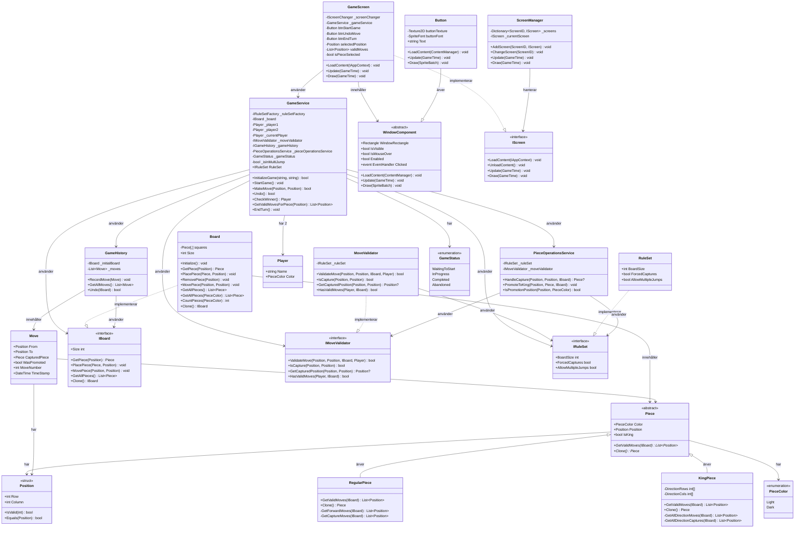

# Class Diagram - Checkers Game

Detta diagram visar huvudklasserna och deras relationer.

## Förklaring av klassrelationer

### Core Game Logic 
- **GameService**: Huvudklassen som koordinerar spellogiken (Facade pattern)
- **Board**: Hanterar brädets state och pjäser
- **MoveValidator**: Validerar drag enligt spelregler
- **PieceOperationsService**: Hanterar capture och promotion

### Piece Hierarchy 
- **Piece**: Abstrakt basklass
- **RegularPiece**: Standard pjäs (rör sig bara framåt)
- **KingPiece**: Dam (rör sig åt alla håll)

### Presentation Layer 
- **GameScreen**: Huvudskärmen för gameplay
- **ScreenManager**: Hanterar växling mellan screens
- **WindowComponent**: Basklass för UI-komponenter

### Design Patterns som syns:
1. **Strategy Pattern**: Piece-hierarkin
2. **Facade Pattern**: GameService
3. **Factory Pattern**: RuleSetFactory (ej visat)
4. **Observer Pattern**: WindowComponent events
5. **Dependency Injection**: Interfaces används överallt
