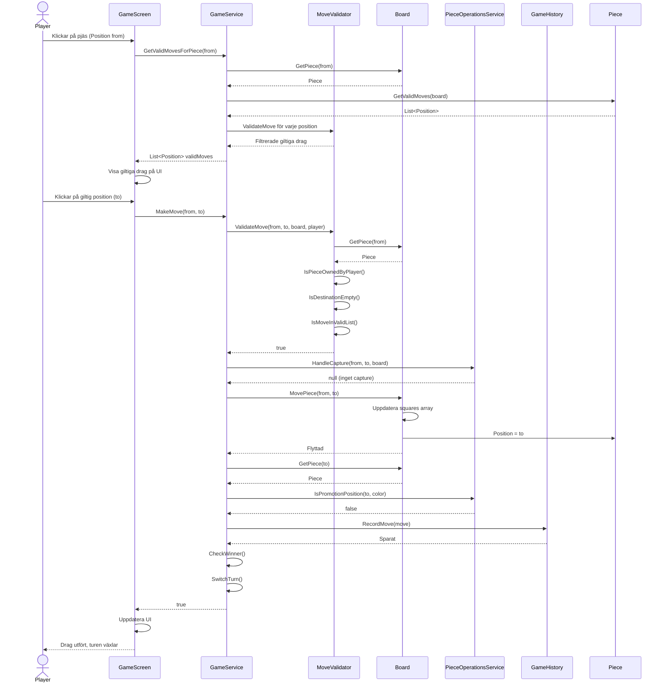
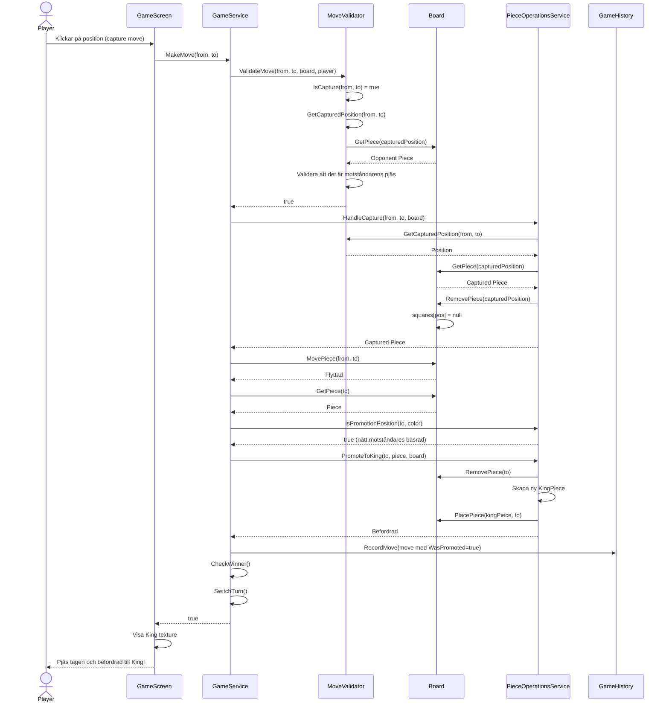
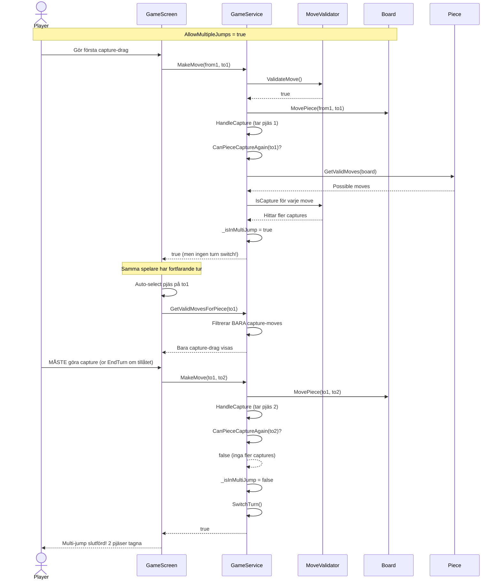
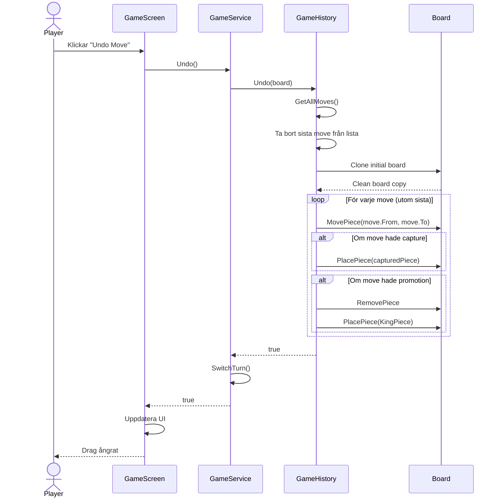
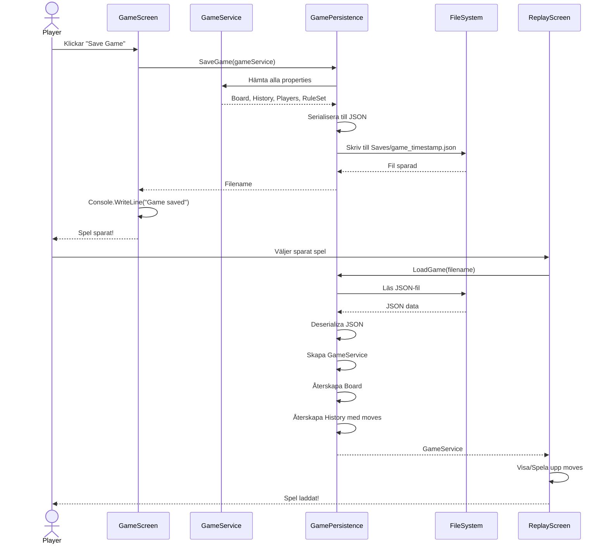

# Sequence Diagrams - Checkers Game

## 1. Gör ett vanligt drag (utan capture)

Detta visar flödet när en spelare gör ett vanligt drag.

---

## 2. Gör ett capture-drag (med promotion till King)

---

## 3. Multi-Jump Capture Sequence

---

## 4. Undo Operation

---

## 5. Spara och Ladda Spel

---

## Viktiga observationer:

### Validering sker på flera nivåer:
1. **Piece.GetValidMoves()**: Returnerar fysiskt möjliga drag (geometri)
2. **MoveValidator.ValidateMove()**: Kontrollerar spelregler (ownership, forced captures, etc)
3. **GameScreen**: Visar bara validerade drag för användaren

### Multi-Jump är event-driven:
- `CanPieceCaptureAgain()` kontrolleras EFTER varje capture
- `_isInMultiJump` flag håller state
- GameScreen auto-selekterar pjäsen för nästa capture

### Undo är ineffektivt men enkelt:
- Replay från början varje gång
- För små spel (< 100 drag) är detta okej
- Command Pattern skulle göra det O(1) istället för O(n)

### Separation of Concerns:
- **GameScreen**: Input och rendering
- **GameService**: Spellogik och koordinering
- **MoveValidator**: Regelvalidering
- **Board**: State management