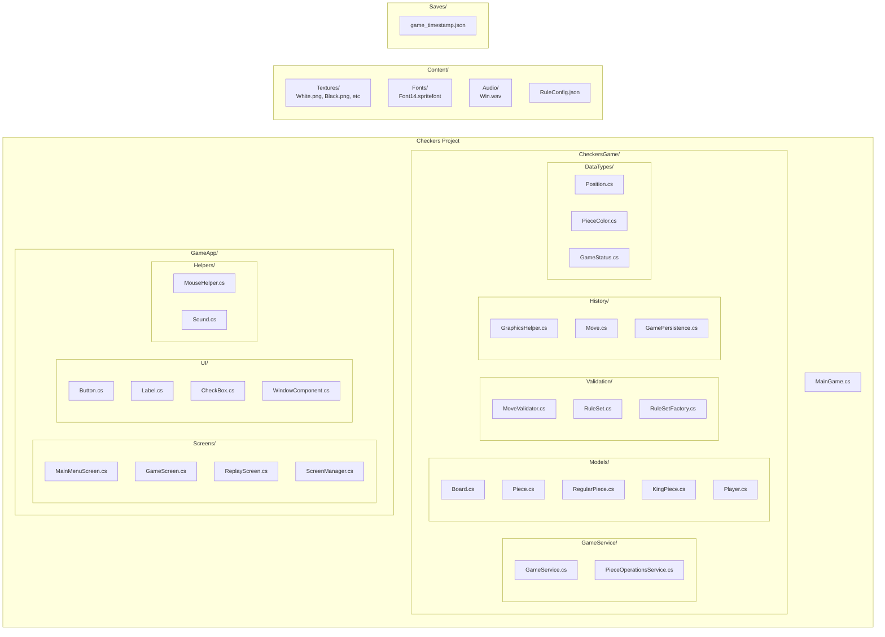
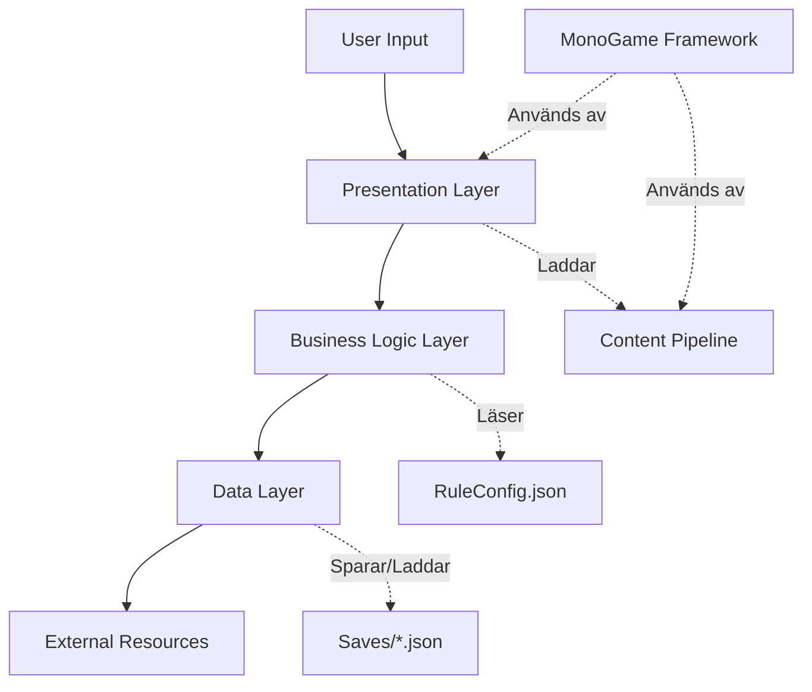
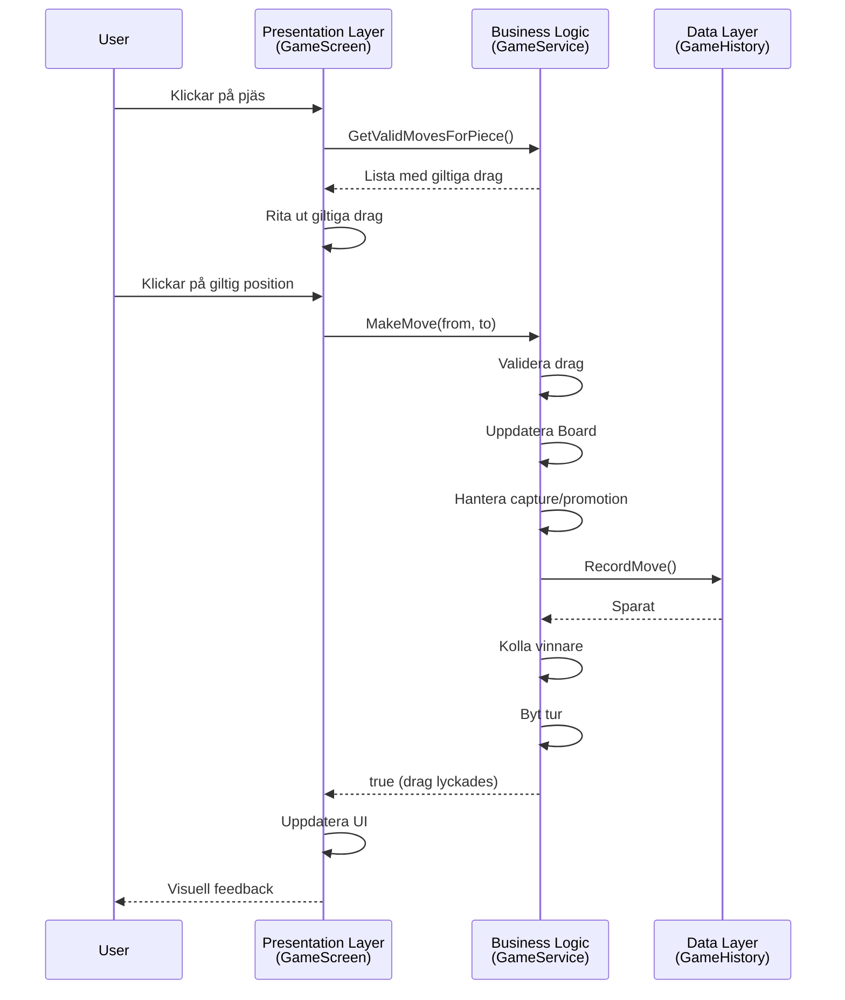

# Architecture Diagram - Checkers Game

## Layered Architecture Overview

```mermaid
graph TB
    subgraph "Presentation Layer"
        MainGame[MainGame.cs<br/>Entry Point]
        ScreenMgr[ScreenManager<br/>Screen Coordinator]

        subgraph "Screens"
            MainMenu[MainMenuScreen]
            GameScreen[GameScreen<br/>Main Gameplay]
            ReplayScreen[ReplayScreen]
        end

        subgraph "UI Components"
            Button[Button]
            Label[Label]
            CheckBox[CheckBox]
            WindowComp[WindowComponent<br/>Base Class]
        end

        subgraph "Helpers"
            MouseHelper[MouseHelper]
            GraphicsHelper[GraphicsHelper]
            Sound[Sound]
        end
    end

    subgraph "Business Logic Layer"
        subgraph "Game Service"
            GameService[GameService<br/>Facade]
            PieceOps[PieceOperationsService]
        end

        subgraph "Validation"
            MoveValidator[MoveValidator]
            RuleSet[RuleSet]
            RuleSetFactory[RuleSetFactory]
        end

        subgraph "Models"
            Board[Board]
            Piece[Piece<br/>Abstract]
            RegularPiece[RegularPiece]
            KingPiece[KingPiece]
            Player[Player]
        end

        subgraph "Data Types"
            Position[Position<br/>Struct]
            PieceColor[PieceColor<br/>Enum]
            GameStatus[GameStatus<br/>Enum]
        end
    end

    subgraph "Data Layer"
        GameHistory[GameHistory]
        Move[Move]
        GamePersistence[GamePersistence<br/>Static]
    end

    subgraph "External Resources"
        Content[Content Pipeline<br/>Textures, Fonts, Audio]
        Config[RuleConfig.json]
        SaveFiles[Saves Folder<br/>JSON Files]
    end

    subgraph "Framework"
        MonoGame[MonoGame Framework<br/>Graphics, Input, Content]
    end

    %% Presentation -> Business Logic
    GameScreen --> GameService
    ReplayScreen --> GameService
    GameScreen --> Button
    GameScreen --> Label
    Button --> WindowComp
    Label --> WindowComp
    GameScreen --> MouseHelper
    GameScreen --> GraphicsHelper

    ScreenMgr --> MainMenu
    ScreenMgr --> GameScreen
    ScreenMgr --> ReplayScreen
    MainGame --> ScreenMgr

    %% Business Logic Relationships
    GameService --> Board
    GameService --> MoveValidator
    GameService --> PieceOps
    GameService --> Player
    GameService --> GameHistory
    GameService --> RuleSet

    MoveValidator --> RuleSet
    PieceOps --> RuleSet
    PieceOps --> MoveValidator

    Board --> Piece
    Piece --> RegularPiece
    Piece --> KingPiece
    Piece --> Position
    Piece --> PieceColor

    RuleSetFactory --> RuleSet
    GameService --> RuleSetFactory

    %% Data Layer
    GameHistory --> Move
    GameHistory --> Board
    GamePersistence --> GameService

    %% External Resources
    RuleSetFactory -.->|Läser| Config
    GamePersistence -.->|Sparar/Laddar| SaveFiles
    GameScreen -.->|Laddar| Content
    MainGame -.->|Laddar| Content

    %% Framework Dependencies
    MainGame --> MonoGame
    GameScreen --> MonoGame
    Button --> MonoGame
    Content --> MonoGame

    %% Styling
    style MainGame fill:
    style GameService fill:
    style Board fill:
    style GameScreen fill:
    style MonoGame fill:
    style Content fill:
    style Config fill:
    style SaveFiles fill:
```



---

## Layer Descriptions

###  Presentation Layer (Blue)
**Ansvar**: Användargränssnitt, rendering, input-hantering

**Komponenter**:
- **MainGame**: Entry point, initialiserar MonoGame och ScreenManager
- **ScreenManager**: Hanterar navigation mellan screens
- **GameScreen**: Huvudgameplay-screen (657 rader - största klassen)
- **UI Components**: Button, Label, CheckBox med event-driven interaction
- **Helpers**: Mouse input, graphics utilities, sound management

**Dependencies**:
- Använder Business Logic Layer för spellogik
- Använder MonoGame för rendering och input
- Laddar content (texturer, fonts, ljud)

---

###  Business Logic Layer (Green)
**Ansvar**: Spelregler, validering, state management

**Komponenter**:
- **GameService**: Facade som koordinerar hela spellogiken
- **Board**: Hanterar 2D-array av pjäser
- **Piece Hierarchy**: RegularPiece och KingPiece med olika rörelselogik
- **MoveValidator**: Validerar drag enligt RuleSet
- **PieceOperationsService**: Hanterar capture och promotion
- **RuleSet & Factory**: Konfigurerbara spelregler från JSON

**Design Patterns**:
- Facade (GameService)
- Strategy (Piece hierarchy)
- Factory (RuleSetFactory)
- Dependency Injection (interfaces överallt)

---

###  Data Layer (Gray)
**Ansvar**: Historik, persistens, serialisering

**Komponenter**:
- **GameHistory**: Lagrar alla drag som Move-objekt
- **Move**: Representerar ett enskilt drag med metadata
- **GamePersistence**: Sparar/laddar spel till JSON-filer

**Funktionalitet**:
- Undo genom att replay:a alla moves utom sista
- Spara spel till `Saves/` folder
- Ladda sparade spel för replay

---

###  External Resources
**Ansvar**: Konfiguration, assets, saved games

**Komponenter**:
- **RuleConfig.json**: BoardSize, ForcedCaptures, AllowMultipleJumps
- **Content Pipeline**: Texturer för pieces, board, UI
- **Saves Folder**: Sparade spel i JSON-format

---

###  Framework Layer (Yellow)
**MonoGame**: Ger:
- Graphics rendering (SpriteBatch)
- Input hantering (Mouse, Keyboard)
- Content loading (Textures, Fonts, Audio)
- Game loop (Update, Draw)

---

## Component Diagram - File Structure



---

## Dependency Flow



---

## Kommunikationsflöde för ett drag



---

## Key Architecture Decisions

###  Bra beslut:

1. **Layered Architecture**: Tydlig separation mellan presentation, business logic och data
2. **Interface-based Design**: Lätt att testa och mocka
3. **Facade Pattern (GameService)**: Döljer komplexitet för presentation layer
4. **MonoGame Content Pipeline**: Standard asset management
5. **JSON Configuration**: Flexibla spelregler utan omkompilering

###  Förbättringsområden:

1. **GameScreen för stor**: 657 rader - borde delas upp
2. **Statisk Sound class**: Borde vara instans-baserad med DI
3. **GamePersistence statisk**: Borde vara Repository pattern
4. **Undo ineffektivt**: Replay all moves - Command pattern skulle vara bättre
5. **Tight coupling**: GameScreen skapar GameService direkt (borde injiceras)

###  Metrics:

- **Total Classes**: ~30
- **Largest Class**: GameScreen (657 rader)
- **Interfaces**: 8 (bra för testbarhet)
- **Design Patterns**: 6 (Factory, Facade, Strategy, Observer, Template Method, DI)
- **Layers**: 3 (Presentation, Business Logic, Data)

---

## Technology Stack

```
┌─────────────────────────────────────┐
│     .NET 8.0 + C#                   │
├─────────────────────────────────────┤
│     MonoGame 3.8.1                  │
├─────────────────────────────────────┤
│  SpriteBatch │ Content Pipeline     │
├──────────────┼──────────────────────┤
│     System.Text.Json (Persistence)  │
├─────────────────────────────────────┤
│        Desktop (Windows/Mac)        │
└─────────────────────────────────────┘
```