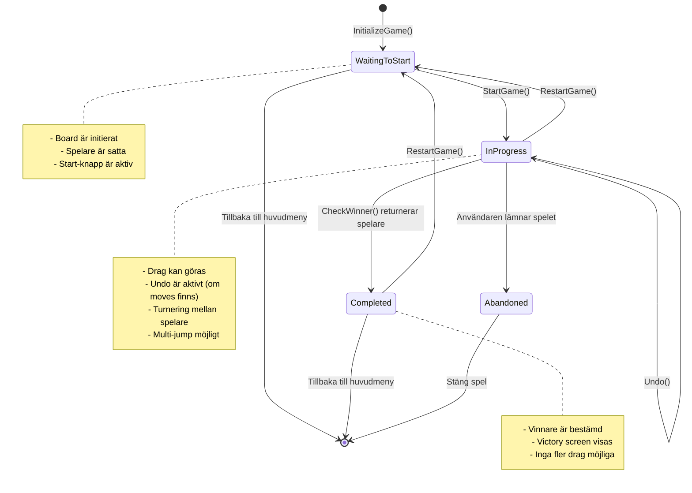
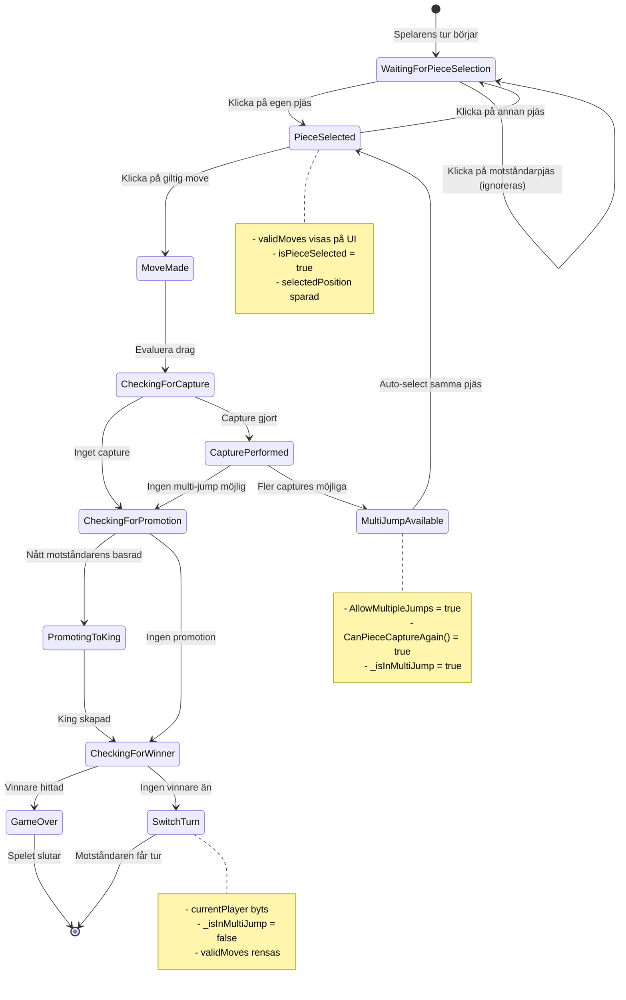
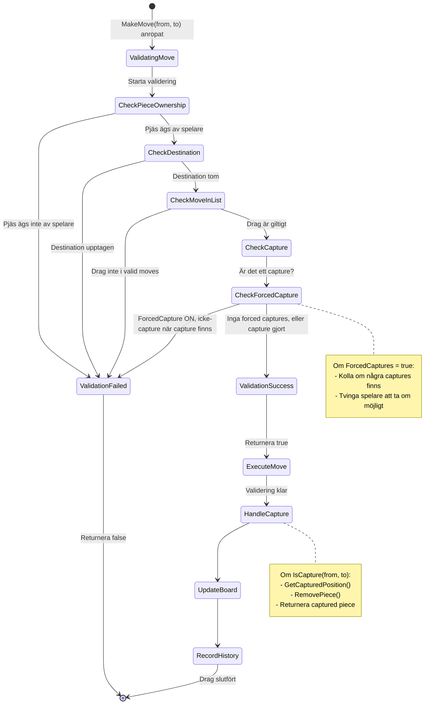
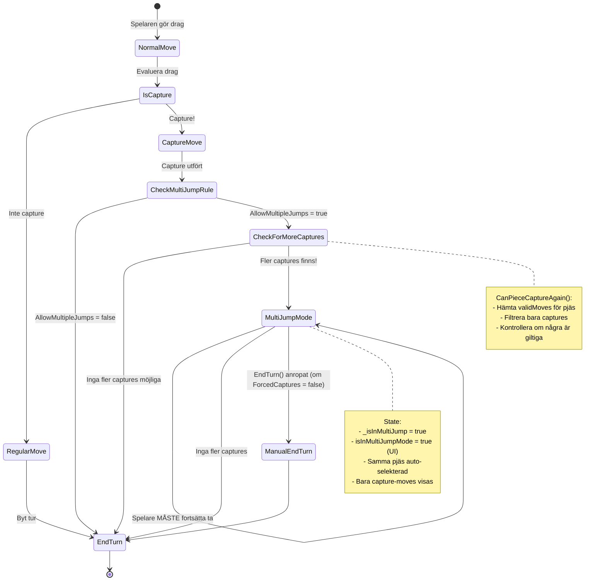
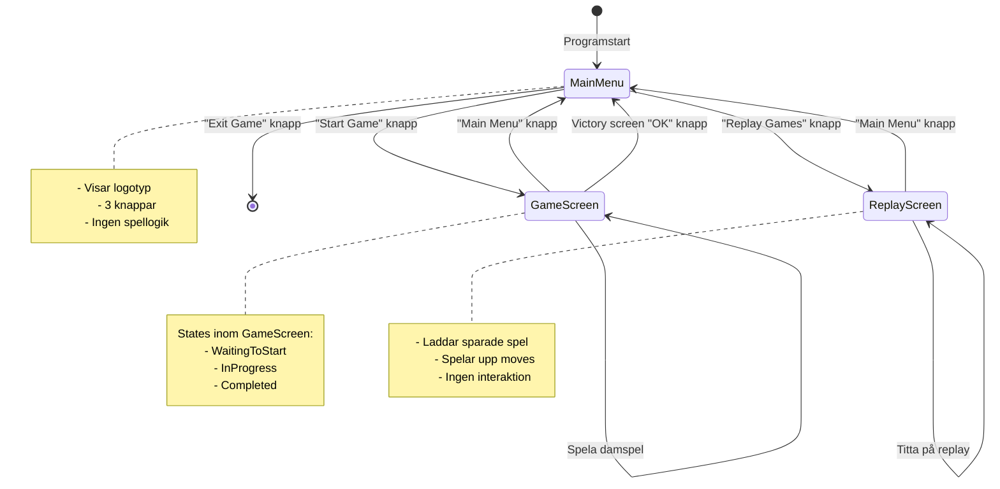
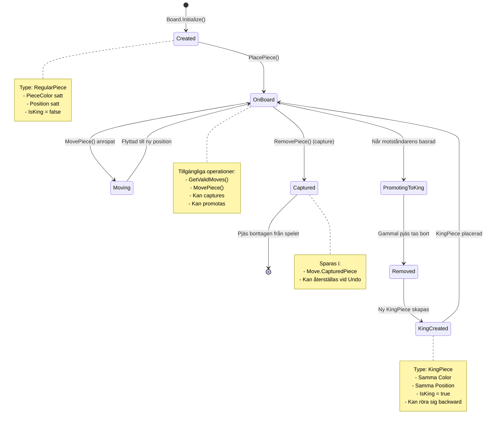
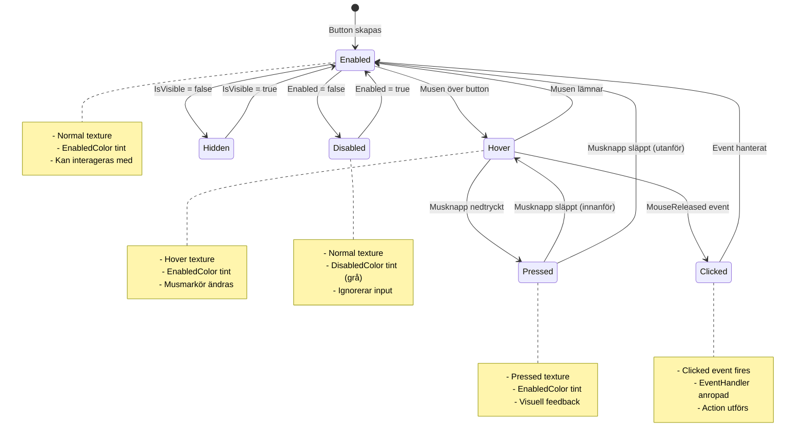

# State Diagrams - Checkers Game

## 1. Game Status State Machine

Detta visar de olika tillstånden som ett spel kan ha.

---

## 2. Player Turn State Machine

Detta visar vad som händer under en spelares tur.

---

## 3. Move Validation State Flow

---

## 4. Multi-Jump Capture State Flow

---

## 5. Screen Navigation State Machine

---

## 6. Piece Lifecycle State Machine

---

## 7. UI Button State Machine

---

## Key State Transitions

###  Kritiska övergångar:

1. **WaitingToStart → InProgress**: När StartGame() anropas
2. **InProgress → Completed**: När CheckWinner() hittar vinnare
3. **NormalMove → MultiJumpMode**: När capture möjliggör fler captures
4. **MultiJumpMode → EndTurn**: När inga fler captures finns

###  Loopar:

1. **InProgress → InProgress**: Normala drag utan vinnare
2. **PieceSelected → PieceSelected**: Byta vald pjäs
3. **MultiJumpMode → MultiJumpMode**: Fortsätta ta pjäser

### ️ Villkorade övergångar:

1. **CaptureMove → MultiJumpMode**: Kräver `AllowMultipleJumps = true`
2. **MultiJumpMode → ManualEndTurn**: Kräver `ForcedCaptures = false`
3. **CheckForcedCapture**: Blockerar icke-captures om captures finns

---

## State Invariants

### GameStatus.InProgress invarianter:
-   Board är initierat med pjäser
-   Exakt en currentPlayer
-   MoveValidator är satt
-   GameHistory existerar
-   Minst en spelare har giltiga drag

### MultiJump invarianter:
-   `_isInMultiJump = true`
-   `AllowMultipleJumps = true` i RuleSet
-   Senaste draget var ett capture
-   Samma pjäs kan ta igen
-   `currentPlayer` är oförändrad

### Completed invarianter:
-   En spelare har vunnit
-   Antingen: motståndaren har 0 pjäser
-   Eller: motståndaren har inga giltiga drag
-   Inga fler drag tillåtna
-   Victory screen visas
