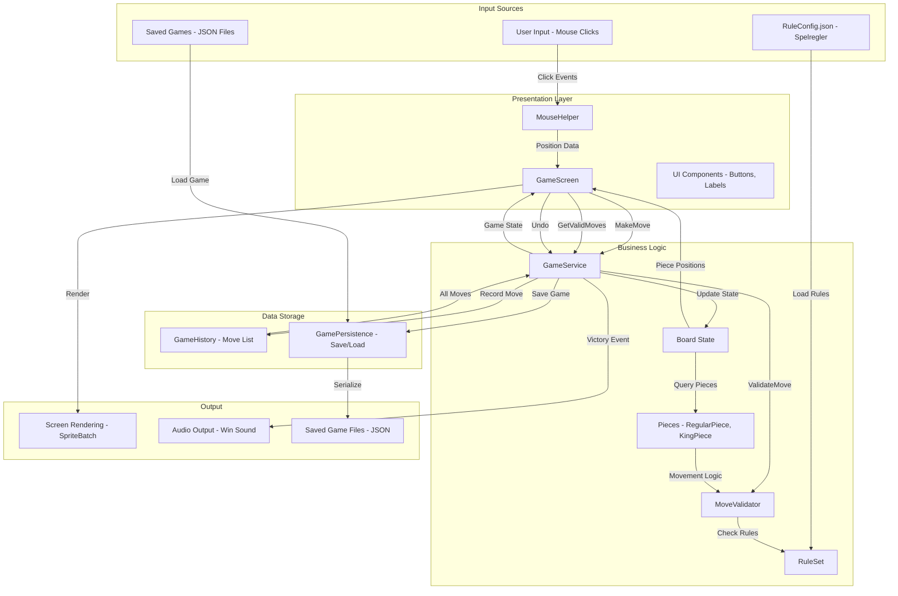
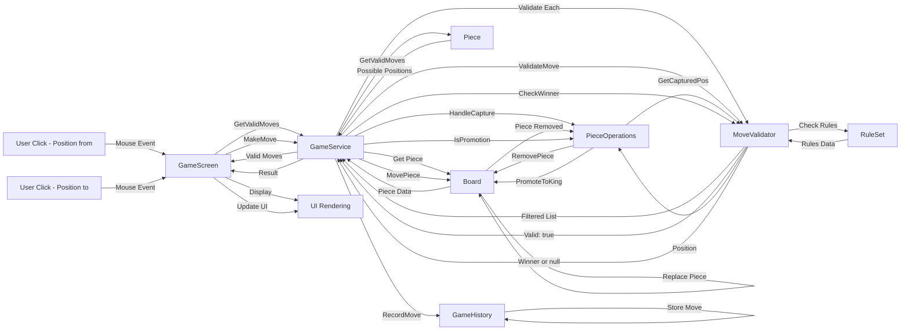
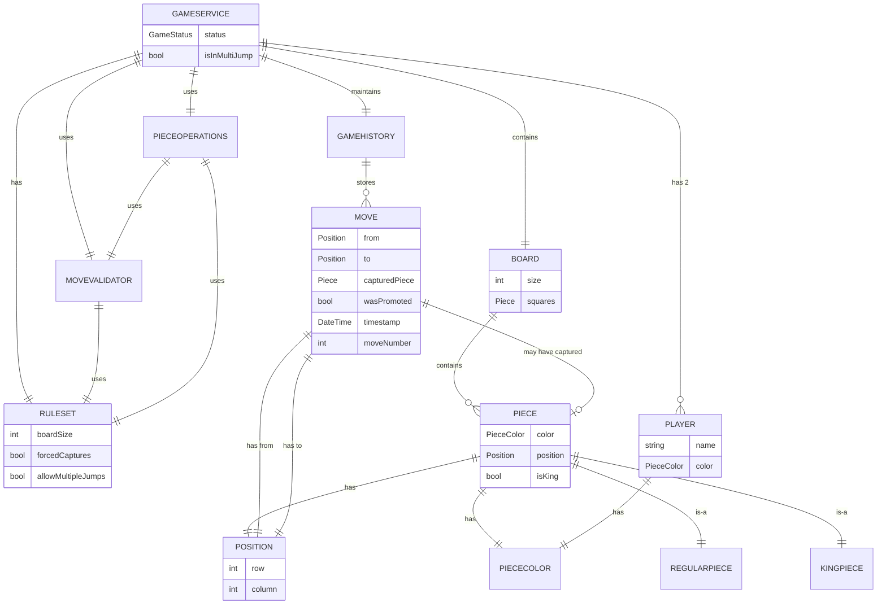
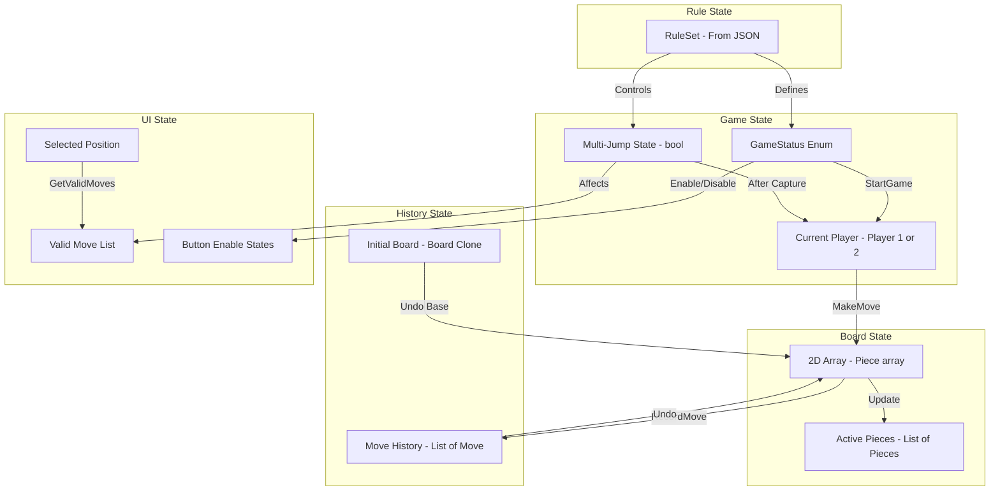
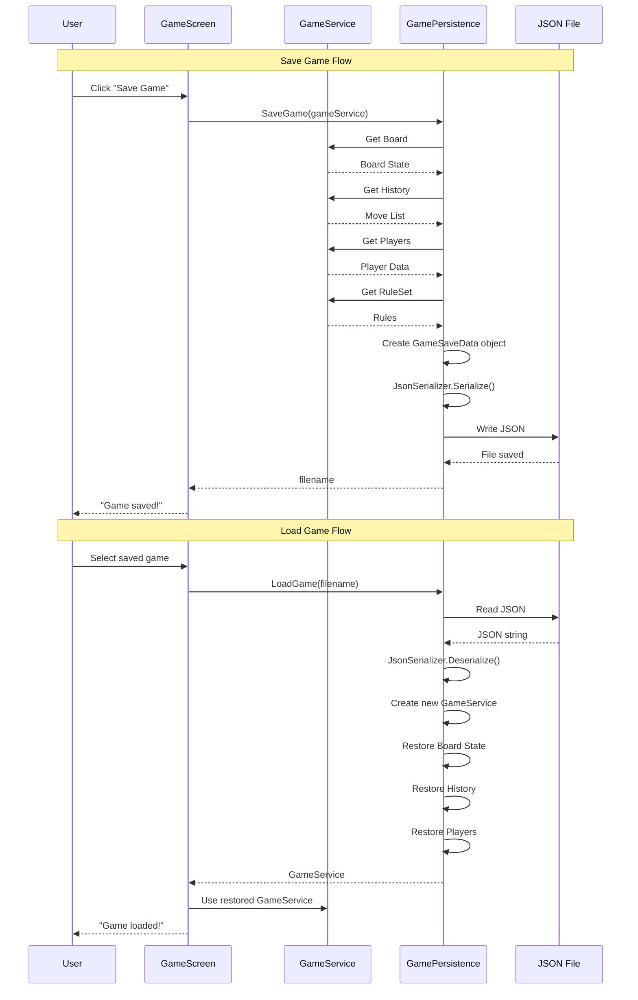
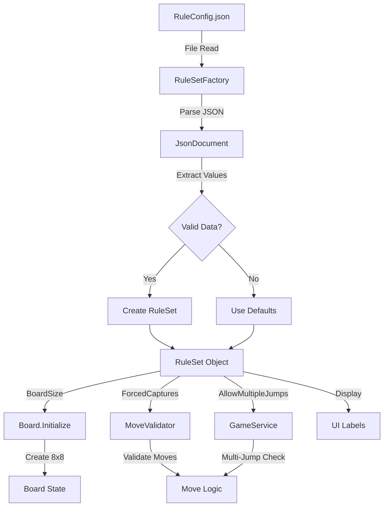
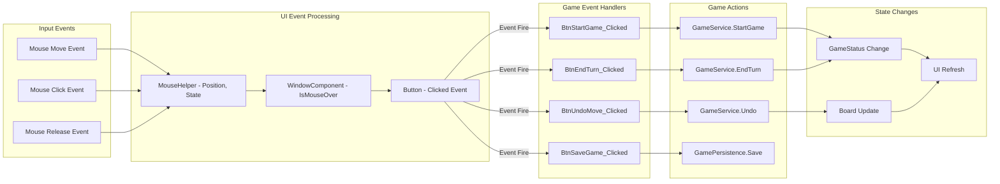

# Data Flow Diagram - Checkers Game

## 1. Overall Data Flow



---

## 2. Move Execution Data Flow



---

## 3. Data Entity Relationship



---

## 4. State Data Flow



---

## 5. Persistence Data Flow



---

## 6. Configuration Data Flow



---

## 7. Event Data Flow



---

## Data Transformation Examples

### 1. User Click → Board Position
```
Mouse Click (pixels) → MouseHelper → Position (pixels)
Position (pixels) ÷ drawScale → Position (grid)
Position (grid) → Position(row, col) struct
```

### 2. Move → History → Undo
```
MakeMove(from, to) → Move object created
Move object → GameHistory.RecordMove()
Move object → List<Move> stored
Undo() → Replay all moves except last
Replayed moves → Board reconstructed
```

### 3. Configuration → Rules → Validation
```
RuleConfig.json → RuleSetFactory.CreateFromJsonFile()
JSON values → RuleSet properties
RuleSet → MoveValidator constructor
RuleSet.ForcedCaptures → ValidateMove logic
```

### 4. Piece → Rendering
```
Piece.Color + Piece.IsKing → Select Texture
Piece.Position → Calculate pixel coordinates
Pixel coords × drawScale → Screen position
Screen position + Texture → SpriteBatch.Draw()
```

---

## Key Data Stores

| Store | Type | Persistence | Owner |
|-------|------|-------------|-------|
| Board State | Piece?[8,8] | Volatile | Board |
| Move History | List\<Move\> | Volatile | GameHistory |
| Game Configuration | RuleSet | File (JSON) | RuleSetFactory |
| Saved Games | GameSaveData | File (JSON) | GamePersistence |
| UI State | Various bools | Volatile | GameScreen |
| Player Info | Player objects | Volatile | GameService |

---

## Data Flow Performance Notes

###  Efficient:
- **Direct array access**: `squares[row, col]` - O(1)
- **Piece movement**: Only updates affected cells
- **Validation caching**: Valid moves calculated once per selection

###  Moderate:
- **GetAllPieces()**: Iterates entire board - O(n²) but n=8 så 64 operationer
- **HasValidMoves()**: Checks all pieces and their moves - O(pieces × moves)

###  Inefficient:
- **Undo via replay**: Replays all moves - O(n) where n = number of moves
- **Victory check every frame**: Could be optimized to only check after moves
- **Board.Clone()**: Copies entire 8x8 array even for empty cells

**Recommendation**: För detta projekt är inefficienserna acceptabla. Märks inte på små bräden och korta spel.